# Articulated Human pose evaluation/benchmark

Benchmark your method against several other methods on the popular [FLIC](http://bensapp.github.io/flic-dataset.html) and [LSP](http://www.comp.leeds.ac.uk/mat4saj/lspet.html) datasets.


# How to use

To benchmark the algorithms simply run the scripts files `benchmark_flic.m` and `benchmark_lsp.m` to evaluate the algorithms on the FLIC and LSP datasets, respectively.


## Adding a new algorithm to the list

Adding predictions of a new algorithm is fairly simple:

1. Create a folder with the name of the algorithm in `algorithms/`.
2. Create a file called `algorithm.txt` and assign a label/alias name for the algorithm to be used to identify the algorithms name in the plot's legend.
3. Add the predictions files with the keypoints/sticks coordinates with the names `pred_keypoints_lsp_oc.mat`, `pred_keypoints_lsp_pc.mat`, `pred_sticks_lsp_oc.mat` and `pred_sticks_lsp_pc.mat`.

> Note: The scripts will skip the missing files when benchmarking a method.


## Options

Several options are available for configuration. These, however, require the user to change the file manually.

Plot options:

- `list`: specify which algorithms to plot. If empty, plots all algorithms.
- `bSave`: save plot images to `plots/` folder (if set to `true`).
- `printLegend`: prints a legend in every plot (if set to `true`).
- `pcp_threshold`: PCP evaluation threshold.
- `pck_threshold`: PCK evaluation threshold.


## Available datasets

For now, the available datasets for PCK and PCP evaluation are the [FLIC](http://bensapp.github.io/flic-dataset.html) and [LSP](http://www.comp.leeds.ac.uk/mat4saj/lspet.html). Other datasets may be introduced if it is justifiable for inclusion.

```
@inproceedings{modec13,
    title={MODEC: Multimodal Decomposable Models for Human Pose Estimation},
    author={Sapp, Benjamin and Taskar, Ben},
    booktitle={In Proc. CVPR},
    year={2013},
}
```

```
@inproceedings{Johnson11,
	title = {Learning Effective Human Pose Estimation from Inaccurate Annotation},
	author = {Johnson, Sam and Everingham, Mark},
	year = {2011},
	booktitle = {IEEE Proc. CVPR}
}
```


## Benchmark results

All available methods for the LSP benchmark were downloaded from [MPII's website](http://human-pose.mpi-inf.mpg.de/#related_benchmarks). 

FLIC methods were gather from some authors's predictions available online.

Results of the algorithms are shown bellow.


### Frames Labeled In Cinema (FLIC)

#### PCK(0.2) - Observer Centric

| Method | Elbow | Wrist |
| --- | --- | --- | 
| Sapp et al., CVPR'13  | 72.5 | 54.5 |
| Yang et al., CVPR'16  | 91.6 | 88.8 |
| Chen et al., NIPS'14  | 89.8 | 86.8 |
| Wei et al., CVPR'16  | 92.5 | 90.0 |
| Newell et al., arXiv'16  | 98.0 | 95.5 |

| | | |
| --- | --- | --- | 
| 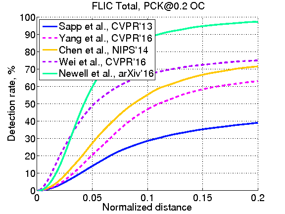 | 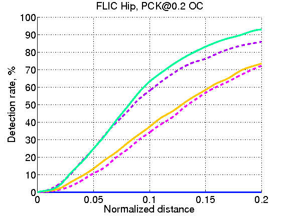 | |
| 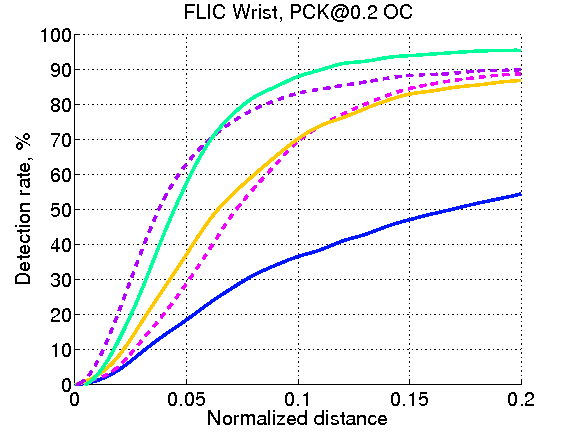 | 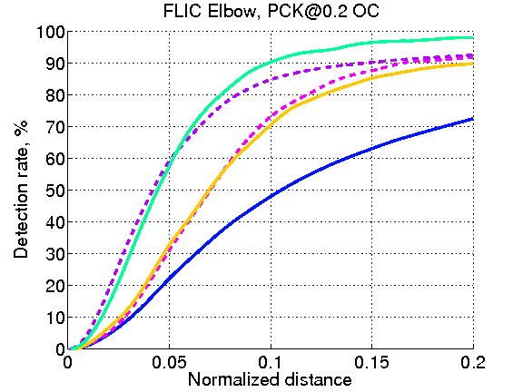  | 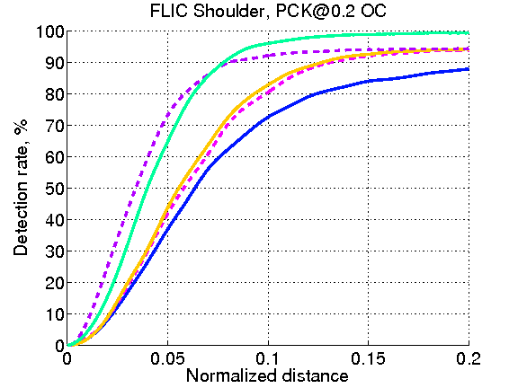 |


### Leeds Sport Pose (LSP)

#### PCP(0.5) - Person Centric

| Method | Torso | Upper leg | Lower leg | Upper arm | Forearm | Head | PCP |
| --- | --- | --- | --- | --- | --- | --- | --- |
| Wang et al., CVPR'13  | 87.5 | 56.0 | 55.8 | 43.1 | 32.1 | 79.1 | 54.1 |
| Pishchulin et al., ICCV' 13  | 88.7 | 63.6 | 58.4 | 46.0 | 35.2 | 85.1 | 58.0 |
| Tompson et al., NIPS'14  | 90.3 | 70.4 | 61.1 | 63.0 | 51.2 | 83.7 | 66.6 |
| Fan et al., CVPR'15  | 95.4 | 77.7 | 69.8 | 62.8 | 49.1 | 86.6 | 70.1 |
| Chen et al., NIPS'14  | 96.0 | 77.2 | 72.2 | 69.7 | 58.1 | 85.6 | 73.6 |
| Yang et al., CVPR'16  | 95.6 | 78.5 | 71.8 | 72.2 | 61.8 | 83.9 | 74.8 |
| Rafi et al., BMVC'16  | 97.6 | 87.3 | 80.2 | 76.8 | 66.2 | 93.3 | 81.2 |
| Belagiannis et al., arXiv'16  | 96.0 | 86.7 | 82.2 | 79.4 | 69.4 | 89.4 | 82.1 |
| Lifshitz et al., ECCV'16  | 97.3 | 88.8 | 84.4 | 80.6 | 71.4 | 94.8 | 84.3 |
| Pishchulin et al., CVPR'16  | 97.0 | 88.8 | 82.0 | 82.4 | 71.8 | 95.8 | 84.3 |
| Yu et al., ECCV'16  | 98.0 | 93.1 | 88.1 | 82.9 | 72.6 | 83.0 | 85.4 |
| Insafutdinov et al., ECCV'16  | 97.0 | 90.6 | 86.9 | 86.1 | 79.5 | 95.4 | 87.8 |
| Wei et al., CVPR'16  | 98.0 | 92.2 | 89.1 | 85.8 | 77.9 | 95.0 | 88.3 |
| Bulat et al., ECCV'16  | 97.7 | 92.4 | 89.3 | 86.7 | 79.7 | 95.2 | 88.9 |


| | | |
| --- | --- | --- |
| 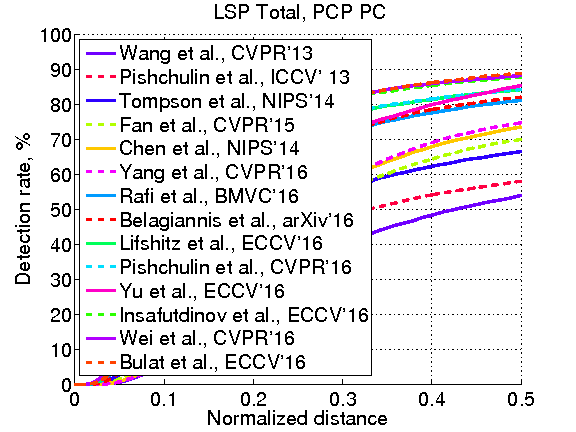 | 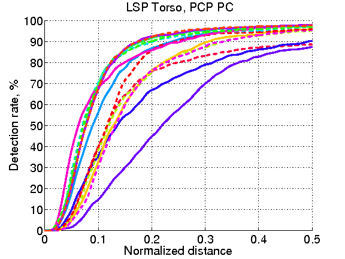 | 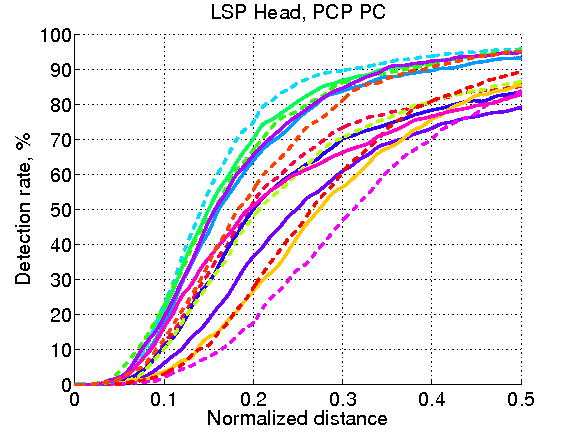
| 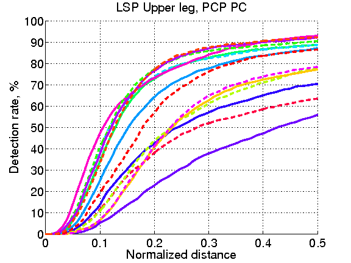 | 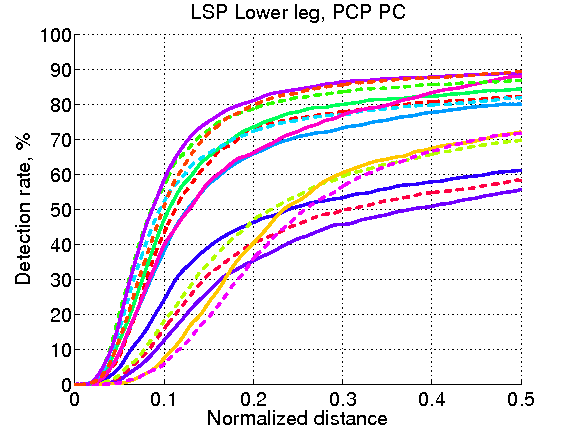 | |
| 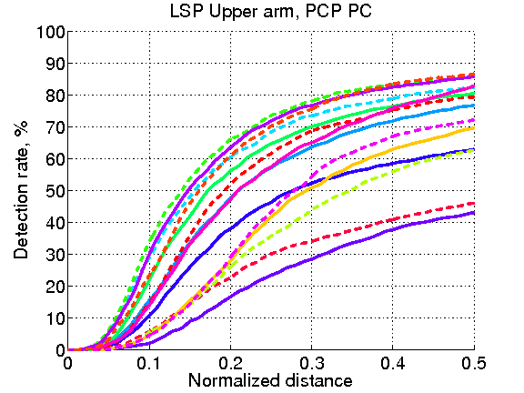 | 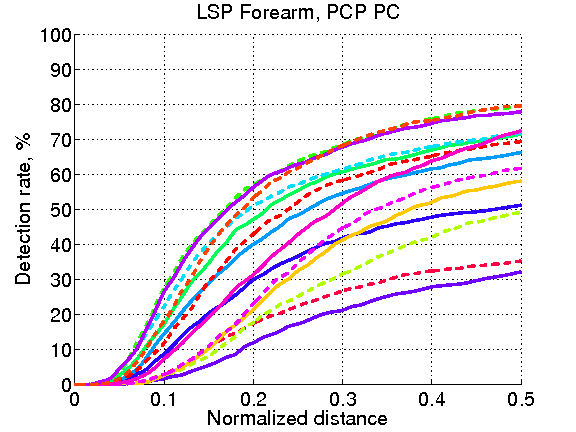 | |


#### PCK(0.2) - Person Centric

| Method | Head | Shoulder | Elbow | Wrist | Hip | Knee  | Ankle | Total |
| --- | --- | --- | --- | --- | --- | ---  | --- | --- |
| Wang et al., CVPR'13  | 84.7 | 57.1  | 43.7  | 36.7  | 56.7  | 52.4 | 50.8 | 54.6 |
| Pishchulin et al., ICCV' 13  | 87.2 | 56.7  | 46.7  | 38.0  | 61.0  | 57.5 | 52.7 | 57.1 |
| Tompson et al., NIPS'14  | 90.6 | 79.2  | 67.9  | 63.4  | 69.5  | 71.0 | 64.2 | 72.3 |
| Fan et al., CVPR'15  | 92.4 | 75.2  | 65.3  | 64.0  | 75.7  | 68.3 | 70.4 | 73.0 |
| Chen et al., NIPS'14  | 91.8 | 78.2  | 71.8  | 65.5  | 73.3  | 70.2 | 63.4 | 73.4 |
| Yang et al., CVPR'16  | 90.6 | 78.1  | 73.8  | 68.8  | 74.8  | 69.9 | 58.9 | 73.6 |
| Rafi et al., BMVC'16  | 95.8 | 86.2  | 79.3  | 75.0  | 86.6  | 83.8 | 79.8 | 83.8 |
| Yu et al., ECCV'16  | 87.2 | 88.2  | 82.4  | 76.3  | 91.4  | 85.8 | 78.7 | 84.3 |
| Belagiannis et al., arXiv'16  | 95.2 | 89.0  | 81.5  | 77.0  | 83.7  | 87.0 | 82.8 | 85.2 |
| Lifshitz et al., ECCV'16  | 96.8 | 89.0  | 82.7  | 79.1  | 90.9  | 86.0 | 82.5 | 86.7 |
| Pishchulin et al., CVPR'16  | 97.0 | 91.0  | 83.8  | 78.1  | 91.0  | 86.7 | 82.0 | 87.1 |
| Insafutdinov et al., ECCV'16  | 97.4 | 92.7  | 87.5  | 84.4  | 91.5  | 89.9 | 87.2 | 90.1 |
| Wei et al., CVPR'16  | 97.8 | 92.5  | 87.0  | 83.9  | 91.5  | 90.8 | 89.9 | 90.5 |
| Bulat et al., ECCV'16  | 97.2 | 92.1  | 88.1  | 85.2  | 92.2  | 91.4 | 88.7 | 90.7 |

| | | |
| --- | --- | --- |
| 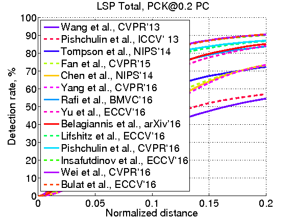 | 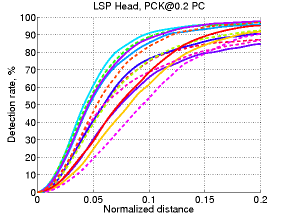 | |
| 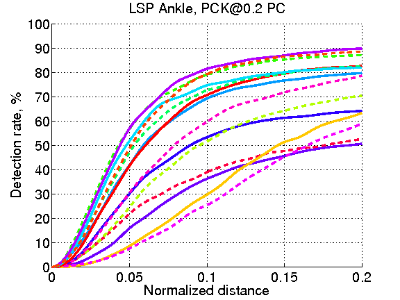 | 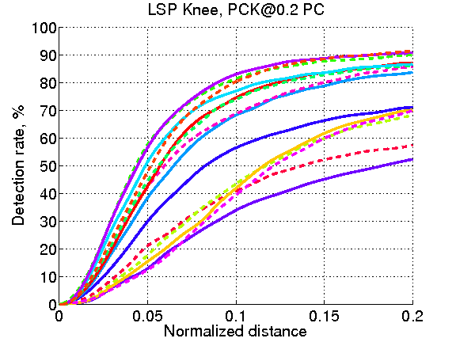 | 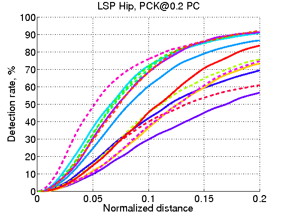 |
| 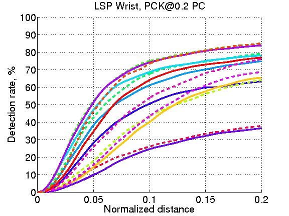 | 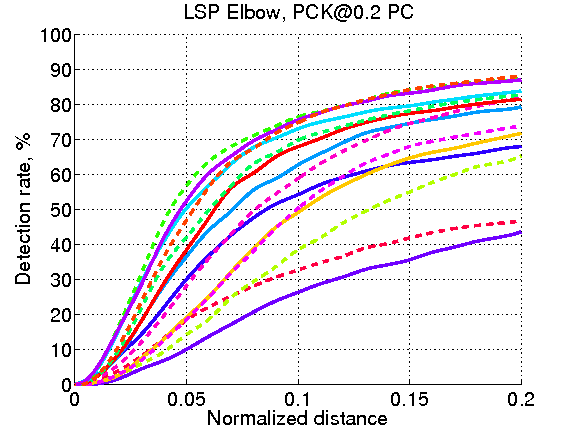 | 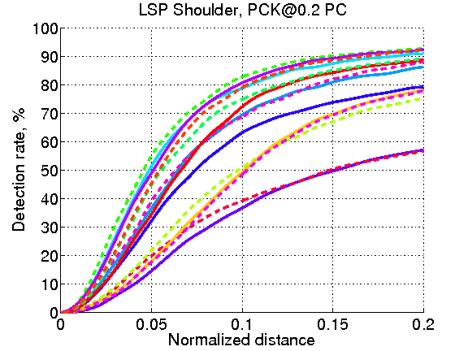 | 


# Acknowledgements

This code is a modified version of the original code made available by [MPII](http://human-pose.mpi-inf.mpg.de/results/lsp/evalLSP.zip).


# License

The available code is released under the MIT license.
